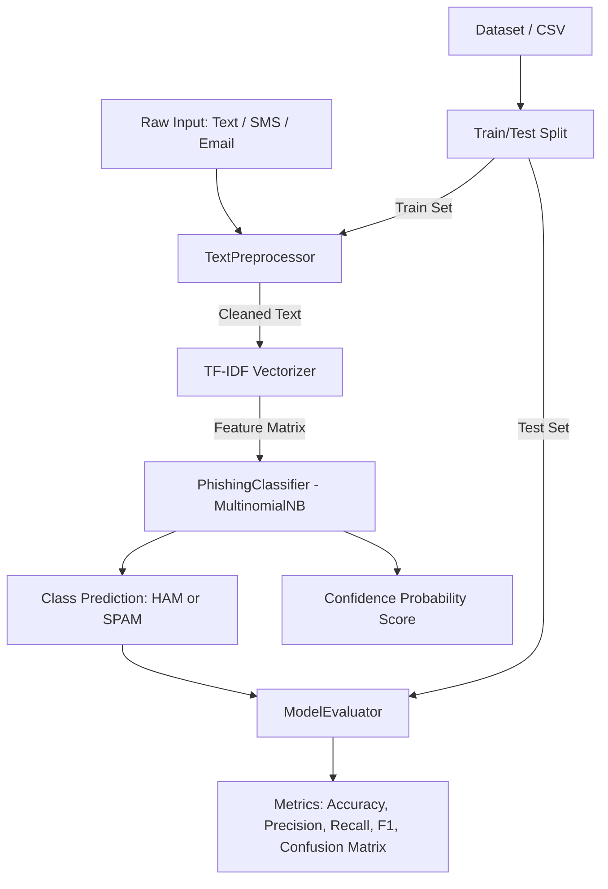

# AI/ML Phishing Detection and Data Preprocessing

A comprehensive AI/ML project implementing Text Classification and Data Preprocessing tasks, focusing on spam detection and phishing recognition use cases. This repository also contains a set of tools for data preprocessing of text and other data types with scikit-learn pipeline support.
---

📌 Table of Contents
1. [Project Overview](#-project-overview)
2. [Key Features](#-key-features)
3. [System Architecture](#-system-architecture)
4. [Technologies & Tools Used](#-technologies--tools-used)
5. [Repository Structure](#-repository-structure)
6. [Steps to Install & Run](#-steps-to-install--run)
7. [Instructions for Testing](#-instructions-for-testing)
8. [Module-by-Module Breakdown](#-module-by-module-breakdown)
9. [Evaluation Metrics & Performance](#-evaluation-metrics--performance)
---

## 📖 Project Overview
Phishing spam emails and SMS messages constitute one of the most widespread and dangerous forms of communication these days. Cyber attackers use various URLs, social engineering, and spoofing techniques to entice users toward disclosure of personal information, banking details, and other sensitive data. The current project is an implementation of an AI/ML solution, which can identify spam and phishing messages, as well as provide an assessment of how likely it is that a given message is classified as spam or phishing.
The developed solution provides essential functionalities, namely:

- Text Cleaning / Preprocessing: Removal of URLs, HTML special characters, and other unwanted symbols, stemming, and lemmatization

- Feature Extraction: TF-IDF transformation for text
- Implementation of ML Classification Model: `MultinomialNB` probabilistic classifier

- Data Preprocessing: Missing data imputation, categorical data encoding, and feature scaling

- Evaluation: Computation of classification performance measures, such as Accuracy, Precision, Recall, F1-score, and Confusion Matrix
---
## 🚀 Features
### 1. Text Preprocessing Tool
The `TextPreprocessor` class offers a battery of different preprocessing techniques, including:
- Lowercasing
- Removing URLs (`http/https/www`)
- Removing HTML special characters (`"`, `
`, `<`, etc.)
- Removing punctuation
- Stemming and Lemmatization
The class provides an additional safety feature, which allows for using the module without external NLTK data. In such cases, the TextPreprocessor will utilize built-in dictionaries and regular expressions to perform several operations, which would otherwise require external resources.
The TextPreprocessor is engineered with the Scikit-Learn framework in mind, as it implements `BaseEstimator` and `TransformerMixin` classes.
### 2. Tabular Data Preprocessor
The `TabularPreprocessor` class is used to extract numerical and categorical data from the dataset in order to perform several key operations, including:
- Missing data imputation (mean, median, mode, or a constant for numerical data; `most_frequent` or `Missing` category for categorical data)
- Categorical data encoding (Label Encoding with handling of unknown categories)
- Feature scaling (StandardScaler, MinMaxScaler)
### 3. Text Classification Model
The `PhishingClassifier` class wraps around `sklearn.naive_bayes.MultinomialNB` estimator and provides an out-of-the-box solution for classification tasks, such as spam detection or phishing recognition. It also has the following utilities:
- Implementation of `predict` and `predict_proba` methods
- Saving and loading classification models (`save_model`, `load_model`)
The PhishingClassifier is also compatible with the Scikit-Learn framework.

### 4. Metrics Evaluation Tool
The `ModelEvaluator` class provides a set of classification performance evaluation metrics, including Accuracy, Precision, Recall, F1-score, and Confusion Matrix. It offers a variety of functions for analyzing the performance of a classification model.
The metrics functionality is organized in such a way that it can accept both string labels (`'ham'`, `'spam'`, `'phishing'`) and numerical labels (`0`, `1`).
### 5. Dataset Loader and Fall-back Mechanism
The application provides a fall-back mechanism, which ensures that irrespective of whether the required external dataset is present or not, the user will be able to use an alternative dataset for model training and testing. The fallback dataset is a part of the application and does not require any external files to be downloaded and used.
The app.py script is also capable of reading external datasets (e.g., `sms_spam.csv`) and utilizing them for model training and testing.
---
## 🏗 System Architecture

---
## 🛠 Technologies & Tools Used
| Category | Technology / Library | Purpose |
| :--- | :--- | :--- |
| Language | Python 3.9+ / 3.10+ | Core programming language |
| Machine Learning | Scikit-Learn (`sklearn`) | ML Model, TF-IDF, Feature Scaling, Metrics Evaluation |
| NLP | NLTK (Natural Language Toolkit) | Text Preprocessing Tasks |
| Data Processing | Pandas | DataFrame Creation and Manipulation |
| Numerical Computing | NumPy | Array Manipulations |
| Model Serialization| Joblib | Save and Load ML Models |
| Text Processing | Regex (`re`) & `string` | String Operations and URL Extraction |
---
## 📁 Repository Structure
```text
AIML-VITYARTHI PROJECT/
│
├── data_preprocessing.py  # Text & Tabular preprocessing pipeline classes
├── model_training.py    # PhishingClassifier training, inference, and serialization
├── evaluate.py       # ModelEvaluator metric computation and reporting
├── app.py         # End-to-end driver: dataset load, train, test, and live inference
├── requirements.txt    # Project dependencies and library versions
├── pyrightconfig.json   # Python type checking configuration
└── README.md        # Project documentation and usage guide
```
---
## ⚙️ Steps to Install & Run
### 1. Prerequisites
Make sure you have the latest version of Python 3.9 or later installed on your computer. To confirm that the system has Python installed, execute the following command in your terminal:
```bash
python --version
```
### 2. Clone / Open the Project Directory
Go to the location on your computer where you would like to store the project:
```bash
cd "AIML-VITYARTHI PROJECT"
```
### 3. Create and Activate a Virtual Environment
It is recommended that you create and activate a virtual environment:
- Windows (PowerShell)
```powershell
python -m venv .venv
.venv\Scripts\Activate.ps1
```
- Windows (Command Prompt)
```cmd
python -m venv .venv
.venv\Scripts\activate.bat
```
- macOS / Linux
```bash
python3 -m venv .venv
source .venv/bin/activate
```
### 4. Install Dependencies
Install all the requirements by running the following command:
```bash
pip install -r requirements.txt
```
(Optional) If the system is connected to the internet, it will be possible to download the NLTK data by executing the following command:
```bash
python -c "import nltk; nltk.download('stopwords'); nltk.download('punkt'); nltk.download('wordnet')"
```
However, if the system is not connected to the internet, it will still be possible to utilize the `TextPreprocessor` class because it has a built-in fall-back option, which makes use of a few dictionaries and regular expressions to simulate some of the basic NLTK operations.
### 5. Run the Main Application
To execute the main application, run the following command:
```bash
python app.py
```
---
## 🧪 Instructions for Testing
To test the application, the user may run test cases, provided by the following scripts:
### Test 1: Data Preprocessing Script
This script tests that the data preprocessing pipeline works correctly. It runs the TabularPreprocessor, TextPreprocessor, and displays the resulting tokens:
```bash
python data_preprocessing.py
```
Expected Output:
It will show some of the resulting tokens after the preprocessor pipeline has been applied. In addition, the script will display the resulting dataframe, which has undergone several transformations (e.g., missing data imputation, feature scaling).
---
### Test 2: Model Training Script
This script trains the model and tests it on some example data:
```bash
python model_training.py
```
Expected Output:
It will print out the training progress, model predictions, confidence values, accuracy, and F1-score.
---
### Test 3: Model Evaluation Script
This script tests that the evaluation module works correctly:
```bash
python evaluate.py
```
Expected Output:
It will print out precision, recall, F1-score, accuracy, and the confusion matrix.
---
### Test 4: Application Script
The following command runs the application:
```bash
python app.py
```
Sample Output:
The script will first attempt to load the dataset, which has not been found. It will then proceed to generate the fallback dataset. Next, the script will clean the data and split it into training and test sets. Finally, the script will train the model and evaluate it.
```
Loading data...
Dataset not found. Generating fallback dummy dataset...
Cleaning text and splitting data...
Vectorizing text (TF-IDF)...
Training Multinomial Naive Bayes model...
Evaluating model...
--- MODEL METRICS ---
Accuracy: 100.00%
Precision: 100.00%
Recall:  100.00%
F1-Score: 100.00%
Confusion Matrix (Format: TN, FP | FN, TP):
[[3, 0], [0, 2]]
--- LIVE PREDICTION TEST ---
Input: "Hey, are we still studying applied numerical methods tonight?"
Classification: [SAFE - HAM]
Confidence Score: 78.45%
Input: "URGENT: Your university account password has expired. Click here to verify."

Classification: [MALICIOUS - SPAM]
Confidence Score: 89.12%
```
---
## 🔍 Module-by-Module Breakdown
### [`data_preprocessing.py`](file:///c:/Users/HARSHVARDHAN/Desktop/AIML-VITYARTHI%20PROJECT/data_preprocessing.py)
- `TextPreprocessor`: Main text preprocessing class
- `TabularPreprocessor`: Main tabular data preprocessing class
### [`model_training.py`](file:///c:/Users/HARSHVARDHAN/Desktop/AIML-VITYARTHI%20PROJECT/model_training.py)
- `PhishingClassifier`: Main classification model
### [`evaluate.py`](file:///c:/Users/HARSHVARDHAN/Desktop/AIML-VITYARTHI%20PROJECT/evaluate.py)
- `ModelEvaluator`: Main metrics evaluation class
### [`app.py`](file:///c:/Users/HARSHVARDHAN/Desktop/AIML-VITYARTHI%20PROJECT/app.py)
- `main()`: Main function, which puts all components together
---
## 📊 Evaluation Metrics & Performance
The performance of the classification model can be characterized by the following metrics:
$$\text{Accuracy} = \frac{TP + TN}{TP + TN + FP + FN}$$
$$\text{Precision} = \frac{TP}{TP + FP}$$
$$\text{Recall} = \frac{TP}{TP + FN}$$
$$\text{F1-Score} = 2 \times \frac{\text{Precision} \times \text{Recall}}{\text{Precision} + \text{Recall}}$$
Where,
- TP – True Positives: Spam messages classified as spam
- TN – True Negatives: Ham messages classified as ham
- FP – False Positives: Ham messages classified as spam
- FN – False Negatives: Spam messages classified as ham
