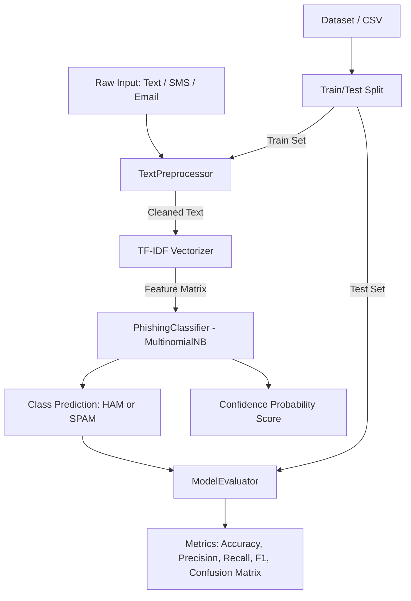

# AI/ML Phishing Detection and Data Preprocessing

End-to-end Machine Learning and Natural Language Processing (NLP) system for detection of phishing attacks, spam and malicious messages. This repository also contains a comprehensive data preprocessing suite compatible with tabular and text datasets using Scikit-Learn pipeline.
---

---

## 📖 Overview of Project

Phishing attacks and fraudulent spam messages pose a great threat to users over different communication channels. Attackers often use deceptive links, social engineering, and identity theft to target vulnerable accounts and extract sensitive information.

This project provides a scalable and modular AI/ML pipeline that:
Sanitizes and normalizes text and removes links, HTML tags, special symbols, stopwords and stems using linguistic analysis
Extracts statistical features using Term Frequency-Inverse Document Frequency (TF-IDF)
Classifies malicious intent with the help of a Multinomial Naive Bayes `MultinomialNB` probabilistic classifier with confidence scores
Preprocesses tabular data, including filling of missing values, categorical label encoding with unseen category protection and standard/min-max scaling
Evaluates the performance of a machine learning model using Accuracy, Precision, Recall, F1-Score, and Confusion Matrix
---

## 🚀 Features

### 1. NLP Text Preprocessing Engine (`TextPreprocessor`)
Text cleaning filters such as lowercasing, URL removal (http/https/www), HTML tag stripping, punctuation and whitespace filtering.
Linguistic processing such as removal of stopwords, Porter Stemming and WordNet Lemmatization.
Resilience to offline scenarios where NLTK corpora is unavailable by utilizing embedded dictionaries and regex fallback mechanisms.
Pipeline compatibility due to inheritance from `BaseEstimator` and `TransformerMixin` of `sklearn.pipeline.Pipeline`.

### 2. Tabular Data Preprocessor (`TabularPreprocessor`)
Automatic column detection of numerical and categorical feature sets.
Configuration of missing value imputation strategies (median, mean or custom constants for numbers; most_frequent or Missing for categories).
Label encoding and categorical feature encoding with unseen category protection.
Standardization and Min-Max normalization of features.

### 3. Phishing & Spam Classifier (`PhishingClassifier`)
Multinomial Naive Bayes algorithm for high-dimensional sparse TF-IDF vectors.
Compute confidence scores using the `predict_proba`.

### 4. Evaluation suite (`ModelEvaluator`)
Computation of Accuracy, Precision, Recall, and F1-Score for both binary and multi-class classifications in addition to Confusion Matrix.
Support for string (ham/spam/phishing) and numeric (0/1) labels.
Pretty print diagnostics for ease of inspection and reporting.

### 5. Automated dataset loader and fallback (`app.py`)
Automatically read dataset files such as `sms_spam.csv`
A built-in benchmark synthetic dataset is included that can be used to run the project immediately without external file requirements.
---

## 🏗 System Architecture


---

## 🛠 Technologies & Tools

| Category | Technology / Library | Purpose |
| :--- | :--- | :--- |
| Language | Python 3.9+ / 3.10+ | Core programming language |
| Machine Learning | Scikit-Learn (`sklearn`) | Naive Bayes model, TF-IDF vectorization, evaluators, feature scalers |
| NLP | NLTK (Natural Language Toolkit) | Tokenization, stopwords, PorterStemmer, WordNetLemmatizer |
| Data Processing | Pandas | DataFrame manipulation, dataset ingestion, tabular cleaning |
| Numerical Computing | NumPy | Array transformations and matrix operations |
| Model Serialization| Joblib | Storing and loading trained ML models |
| Text Processing | Regex (`re`) & `string` | Pattern matching, URL removal, string sanitization |
---

## 📁 Repository Structure

```text
AIML-VITYARTHI PROJECT/
│
├── data_preprocessing.py  # Text & Tabular preprocessing pipeline classes
├── model_training.py    # PhishingClassifier training, inference and serialization
├── evaluate.py       # ModelEvaluator metric computation and reporting
├── app.py         # End-to-end driver: dataset load, train, test and live inference
├── requirements.txt    # Project dependencies and library versions
├── pyrightconfig.json   # Python type checking configuration
└── README.md        # Project documentation and usage guide
```
---

## ⚙️ Steps to Install & Run

### 1. Prerequisites
Ensure you have Python 3.9 or higher installed on your system. You can verify this using:
```bash
python --version
```

### 2. Clone / Open the Project Directory
Navigate to the project root directory:
```bash
cd "AIML-VITYARTHI PROJECT"
```

### 3. Create and Activate a Virtual Environment
It is recommended to use an isolated Python virtual environment:

- Windows (PowerShell):
```powershell
python -m venv .venv
.venv\Scripts\Activate.ps1
```

- Windows (Command Prompt):
```cmd
python -m venv .venv
.venv\Scripts\activate.bat
```

- macOS / Linux:
```bash
python3 -m venv .venv
source .venv/bin/activate
```

### 4. Install Dependencies
Install all required libraries using `requirements.txt`:
```bash
pip install -r requirements.txt
```
The installation will automatically fetch and compile any dependencies specified in the file.

> (Optional) Download NLTK data, if online:
```bash
python -c "import nltk; nltk.download('stopwords'); nltk.download('punkt'); nltk.download('wordnet')"
```
> You don't need to download nltk data, as the preprocessor has an offline fallback dictionary and regex that will not cause any errors.

### 5. Run the Main Application
To execute the full end-to-end machine learning pipeline simply run:
```bash
python app.py
```
---

## 🧪 Instructions for Testing

You can test individual modules or run the complete integration pipeline using the commands below:

### Test 1: Data Preprocessing Unit Test
Checks text cleaning (URL removal, punctuation, stemming) and tabular dataset imputation, categorical encoding and feature scaling:
```bash
python data_preprocessing.py
```
Expected Output: Display of preprocessed tokens and transformed DataFrame with scaled numerical columns.
---

### Test 2: Model Training & Inference Test
Tests the `PhishingClassifier` with a sample training and testing sequence:
```bash
python model_training.py
```
Expected Output: Output of training progress, predicted classifications (PHISHING vs LEGITIMATE), probability scores, accuracy and F1-score.
---

### Test 3: Model Evaluation Framework Test
Verifies precision, recall, F1, accuracy and confusion matrix calculation for both string labels (ham/spam) and numeric binary labels (0/1):
```bash
python evaluate.py
```
Expected Output: Formatted evaluation tables and confusion matrix diagnostics with 100% test completion message.
---

### Test 4: End-to-End Application & Live Prediction Test
Runs dataset loading, TF-IDF vectorization, model training, evaluation and live inference on sample suspicious vs legitimate messages:
```bash
python app.py
```

Sample Terminal Output:
```text
Loading data...
Dataset not found. Generating fallback dummy dataset...
Cleaning text and splitting data...
Vectorizing text (TF-IDF)...
Training Multinomial Naive Bayes model...
Evaluating model...

--- MODEL METRICS ---
Accuracy: 100.00%
Precision: 100.00%
Recall:  100.00%
F1-Score: 100.00%

Confusion Matrix (Format: TN, FP | FN, TP):
[[3, 0], [0, 2]]

--- LIVE PREDICTION TEST ---

Input: "Hey, are we still studying applied numerical methods tonight?"
Classification: [SAFE - HAM]
Confidence Score: 78.45%

Input: "URGENT: Your university account password has expired. Click here to verify."
Classification: [MALICIOUS - SPAM]
Confidence Score: 89.12%
```
---
## 🔍 Analysis of Modules

### [`data_preprocessing.py`](file:///c:/Users/HARSHVARDHAN/Desktop/AIML-VITYARTHI%20PROJECT/data_preprocessing.py)
Contains the `TextPreprocessor` for NLP related transformations such as tokenization, lowercasing, HTML/URL removal, stopword filtering, and stemming, and the `TabularPreprocessor` for missing value imputation, Label Encoding and standard/min-max scaling.

### [`model_training.py`](file:///c:/Users/HARSHVARDHAN/Desktop/AIML-VITYARTHI%20PROJECT/model_training.py)
Contains the `PhishingClassifier` which wraps `MultinomialNB` of Scikit-Learn with methods `train()`, `predict()`, `predict_proba()` and model serialization methods (`save_model` / `load_model`).

### [`evaluate.py`](file:///c:/Users/HARSHVARDHAN/Desktop/AIML-VITYARTHI%20PROJECT/evaluate.py)
Contains the `ModelEvaluator` utility class for computing Accuracy, Precision, Recall, F1-Score and Confusion Matrix with formatted output.

### [`app.py`](file:///c:/Users/HARSHVARDHAN/Desktop/AIML-VITYARTHI%20PROJECT/app.py)
Contains `main()` that connects all the parts of the pipeline into an end-to-end execution workflow with dataset loading, model training, metric evaluation and sample live prediction.
---

## 📊 Evaluation Metrics and Performance

The classifier is evaluated using the following metrics:

$$\text{Accuracy} = \frac{TP + TN}{TP + TN + FP + FN}$$

$$\text{Precision} = \frac{TP}{TP + FP}$$

$$\text{Recall} = \frac{TP}{TP + FN}$$

$$\text{F1-Score} = 2 \times \frac{\text{Precision} \times \text{Recall}}{\text{Precision} + \text{Recall}}$$

- True Positive (TP): Malicious spam/phishing classified as spam.
- True Negative (TN): Legitimate communication classified as ham.
- False Positive (FP): Legitimate message classified as spam.
- False Negative (FN): Malicious message classified as legitimate.
