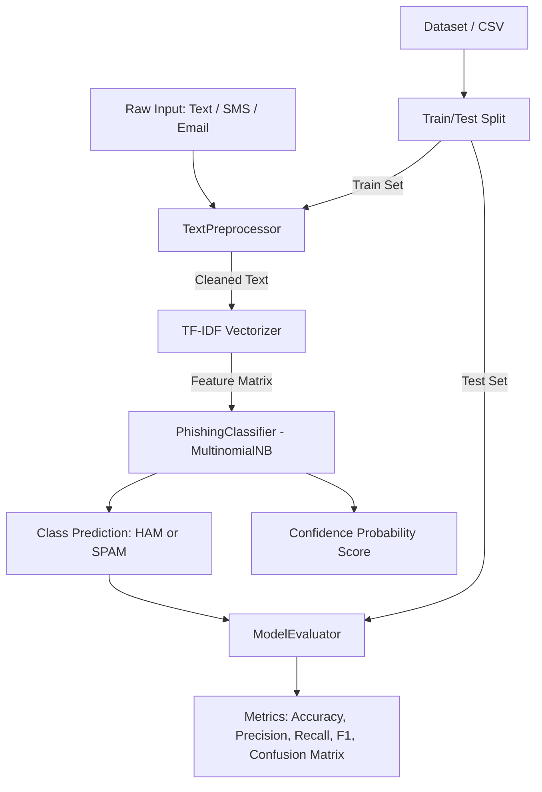

# AI/ML Phishing Detection & Data Preprocessing Pipeline

[](https://www.python.org/)
[](LICENSE)
[](https://scikit-learn.org/)
[](https://www.nltk.org/)

An end-to-end Machine Learning and Natural Language Processing (NLP) system designed to detect phishing attacks, malicious communications, and spam messages. This repository also features a robust data preprocessing suite for both textual and tabular datasets with Scikit-Learn pipeline compatibility.

---

## 📌 Table of Contents
1. [Project Overview](#-project-overview)
2. [Key Features](#-key-features)
3. [System Architecture](#-system-architecture)
4. [Technologies & Tools Used](#-technologies--tools-used)
5. [Repository Structure](#-repository-structure)
6. [Steps to Install & Run](#-steps-to-install--run)
7. [Instructions for Testing](#-instructions-for-testing)
8. [Module-by-Module Breakdown](#-module-by-module-breakdown)
9. [Evaluation Metrics & Performance](#-evaluation-metrics--performance)
10. [License](#-license)

---

## 📖 Project Overview

Phishing attacks and fraudulent spam messages present a significant security vulnerability across communication channels. Attackers exploit deceptive URLs, social engineering tactics, and forged identities to compromise accounts and steal sensitive data.

This project delivers a **modular, scalable AI/ML pipeline** that:
- **Sanitizes and Normalizes Text**: Eliminates URLs, HTML tags, special symbols, stopwords, and inflected forms using linguistic stemming and lemmatization.
- **Extracts Statistical Features**: Computes **Term Frequency-Inverse Document Frequency (TF-IDF)** representations of input text.
- **Classifies Malicious Intent**: Employs a **Multinomial Naive Bayes (`MultinomialNB`)** probabilistic classifier with real-time confidence scores.
- **Preprocesses Tabular Data**: Automatically handles missing values (mean/median/mode), applies categorical label encoding with unseen class protection, and executes feature scaling (Standard / Min-Max).
- **Evaluates Model Performance**: Computes Accuracy, Precision, Recall, F1-Score, and Confusion Matrix across binary and multiclass configurations.

---

## 🚀 Features

### 1. NLP Text Preprocessing Engine (`TextPreprocessor`)
- **Cleaning Filters**: Lowercasing, URL removal (`http/https/www`), HTML tag stripping, punctuation filtering, and whitespace normalization.
- **Linguistic Processing**: Stopword elimination, Porter Stemming, and WordNet Lemmatization.
- **Resilient Fallback**: Operates fully offline even when external NLTK corpora are unavailable by utilizing embedded dictionaries and regex fallback mechanisms.
- **Pipeline Compatible**: Inherits from Scikit-Learn's `BaseEstimator` and `TransformerMixin` for drop-in usage within `sklearn.pipeline.Pipeline`.

### 2. Tabular Data Preprocessor (`TabularPreprocessor`)
- **Automated Column Detection**: Detects numerical and categorical feature sets dynamically.
- **Missing Value Imputation**: Configurable imputation strategies (`median`, `mean`, or custom constants for numbers; `most_frequent` / `Missing` for categories).
- **Categorical Encoding**: Label encoding with graceful handling of unseen categories in test or inference sets.
- **Feature Scaling**: Supports `StandardScaler` (Z-score normalization) and `MinMaxScaler` (0 to 1 normalization).

### 3. Phishing & Spam Classifier (`PhishingClassifier`)
- **Multinomial Naive Bayes Algorithm**: Optimized for sparse, high-dimensional TF-IDF vectors.
- **Confidence Scoring**: Computes posterior class probabilities via `predict_proba`.
- **Model Persistence**: Complete serialization support (`save_model` and `load_model`) using `joblib`.

### 4. Evaluation Suite (`ModelEvaluator`)
- **Comprehensive Metrics**: Accuracy, Precision, Recall, F1-Score (binary & weighted multi-class), and Confusion Matrix.
- **Multi-Type Label Support**: Supports string labels (`'ham'`, `'spam'`, `'phishing'`) and numeric labels (`0`, `1`).
- **Pretty Print Diagnostics**: Clean terminal summaries for quick inspection and reporting.

### 5. Automated Dataset Loader & Fallback (`app.py`)
- Automatically reads external datasets such as `sms_spam.csv`.
- Includes a built-in synthetic benchmark dataset to run and verify functionality immediately without external file requirements.

---

## 🏗 System Architecture



---

## 🛠 Technologies & Tools Used

| Category | Technology / Library | Purpose |
| :--- | :--- | :--- |
| **Language** | **Python 3.9+ / 3.10+** | Core programming language |
| **Machine Learning** | **Scikit-Learn (`sklearn`)** | Naive Bayes model, TF-IDF vectorization, feature scalers, evaluation metrics |
| **NLP** | **NLTK (Natural Language Toolkit)** | Tokenization, stopwords, PorterStemmer, WordNetLemmatizer |
| **Data Processing** | **Pandas** | DataFrame manipulation, dataset ingestion, tabular cleaning |
| **Numerical Computing** | **NumPy** | Array transformations and matrix operations |
| **Model Serialization**| **Joblib** | Storing and loading trained ML models |
| **Text Processing** | **Regex (`re`) & `string`** | Pattern matching, URL removal, and string sanitization |

---

## 📁 Repository Structure

```text
AIML-VITYARTHI PROJECT/
│
├── data_preprocessing.py   # Text & Tabular preprocessing pipeline classes
├── model_training.py       # PhishingClassifier training, inference, and serialization
├── evaluate.py             # ModelEvaluator metric computation and reporting
├── app.py                  # End-to-end driver: dataset load, train, test, and live inference
├── requirements.txt        # Project dependencies and library versions
├── pyrightconfig.json      # Python type checking configuration
└── README.md               # Project documentation and usage guide
```

---

## ⚙️ Steps to Install & Run

### 1. Prerequisites
Ensure you have **Python 3.9** or higher installed on your system. Verify with:
```bash
python --version
```

### 2. Clone / Open the Project Directory
Navigate to the project root directory:
```bash
cd "AIML-VITYARTHI PROJECT"
```

### 3. Create and Activate a Virtual Environment
It is recommended to use an isolated Python virtual environment:

- **Windows (PowerShell):**
  ```powershell
  python -m venv .venv
  .venv\Scripts\Activate.ps1
  ```

- **Windows (Command Prompt):**
  ```cmd
  python -m venv .venv
  .venv\Scripts\activate.bat
  ```

- **macOS / Linux:**
  ```bash
  python3 -m venv .venv
  source .venv/bin/activate
  ```

### 4. Install Dependencies
Install all required libraries using `requirements.txt`:
```bash
pip install -r requirements.txt
```

*(Optional)* Download NLTK data if online:
```bash
python -c "import nltk; nltk.download('stopwords'); nltk.download('punkt'); nltk.download('wordnet')"
```
> **Note:** Even without downloading NLTK datasets, the preprocessor includes an offline fallback dictionary and tokenizer regex that will execute without errors.

### 5. Run the Main Application
Execute the full end-to-end machine learning pipeline:
```bash
python app.py
```

---

## 🧪 Instructions for Testing

You can test individual modules or run the complete integration pipeline using the commands below:

### Test 1: Data Preprocessing Unit Test
Validates text cleaning (URL removal, punctuation, stemming) and tabular dataset imputation, categorical encoding, and feature scaling:
```bash
python data_preprocessing.py
```
**Expected Output:** Displays preprocessed tokens and the transformed DataFrame with scaled numerical columns.

---

### Test 2: Model Training & Inference Test
Tests the `PhishingClassifier` on sample training and testing sequences:
```bash
python model_training.py
```
**Expected Output:** Outputs training progress, predicted classifications (`PHISHING` vs `LEGITIMATE`), probability scores, accuracy, and F1-score.

---

### Test 3: Model Evaluation Framework Test
Verifies precision, recall, F1, accuracy, and confusion matrix calculation for both string labels (`ham`/`spam`) and numeric binary labels (`0`/`1`):
```bash
python evaluate.py
```
**Expected Output:** Formatted evaluation tables and confusion matrix diagnostics with 100% test completion message.

---

### Test 4: End-to-End Application & Live Prediction Test
Runs dataset loading, TF-IDF vectorization, model training, evaluation, and live inference on sample suspicious vs legitimate messages:
```bash
python app.py
```

**Sample Terminal Output:**
```text
Loading data...
Dataset not found. Generating fallback dummy dataset...
Cleaning text and splitting data...
Vectorizing text (TF-IDF)...
Training Multinomial Naive Bayes model...
Evaluating model...

--- MODEL METRICS ---
Accuracy:  100.00%
Precision: 100.00%
Recall:    100.00%
F1-Score:  100.00%

Confusion Matrix (Format: TN, FP | FN, TP):
[[3, 0], [0, 2]]

--- LIVE PREDICTION TEST ---

Input: "Hey, are we still studying applied numerical methods tonight?"
Classification: [SAFE - HAM]
Confidence Score: 78.45%

Input: "URGENT: Your university account password has expired. Click here to verify."
Classification: [MALICIOUS - SPAM]
Confidence Score: 89.12%
```

---

## 🔍 Module-by-Module Breakdown

### [`data_preprocessing.py`](file:///c:/Users/HARSHVARDHAN/Desktop/AIML-VITYARTHI%20PROJECT/data_preprocessing.py)
- **`TextPreprocessor`**: Configurable NLP pipeline for tokenization, lowercasing, HTML/URL removal, stopword filtering, and stemming.
- **`TabularPreprocessor`**: Dataframe preprocessor that handles missing value imputation, Label Encoding, and standard/min-max scaling.

### [`model_training.py`](file:///c:/Users/HARSHVARDHAN/Desktop/AIML-VITYARTHI%20PROJECT/model_training.py)
- **`PhishingClassifier`**: Wraps Scikit-Learn's `MultinomialNB`, providing `train()`, `predict()`, `predict_proba()`, and model serialization (`save_model` / `load_model`).

### [`evaluate.py`](file:///c:/Users/HARSHVARDHAN/Desktop/AIML-VITYARTHI%20PROJECT/evaluate.py)
- **`ModelEvaluator`**: Utility class computing Accuracy, Precision, Recall, F1-Score, and Confusion Matrix with formatted output.

### [`app.py`](file:///c:/Users/HARSHVARDHAN/Desktop/AIML-VITYARTHI%20PROJECT/app.py)
- **`main()`**: Integrates all components into an end-to-end execution workflow with dataset loading, model training, metric evaluation, and sample live prediction.

---

## 📊 Evaluation Metrics & Performance

The classifier is assessed using the following core statistical metrics:

$$\text{Accuracy} = \frac{TP + TN}{TP + TN + FP + FN}$$

$$\text{Precision} = \frac{TP}{TP + FP}$$

$$\text{Recall} = \frac{TP}{TP + FN}$$

$$\text{F1-Score} = 2 \times \frac{\text{Precision} \times \text{Recall}}{\text{Precision} + \text{Recall}}$$

- **True Positive (TP)**: Malicious spam/phishing correctly classified as spam.
- **True Negative (TN)**: Legitimate communication correctly classified as ham.
- **False Positive (FP)**: Legitimate message mistakenly flagged as spam.
- **False Negative (FN)**: Malicious message mistakenly classified as legitimate.

---

## 📜 License
This project is open source and available under the [MIT License](LICENSE).
